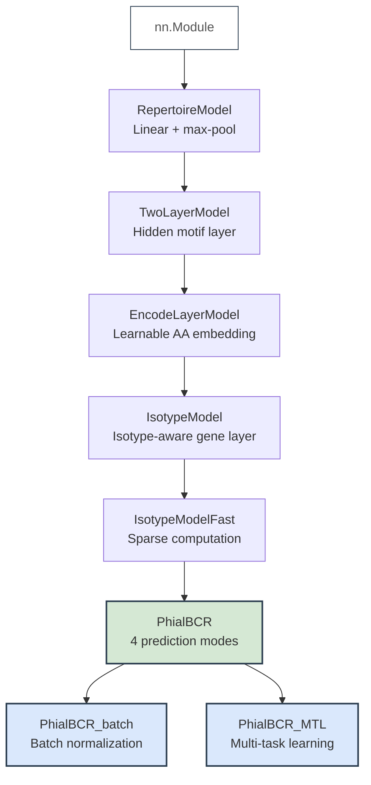
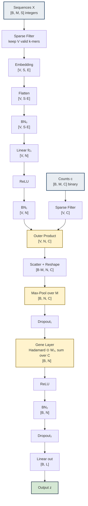
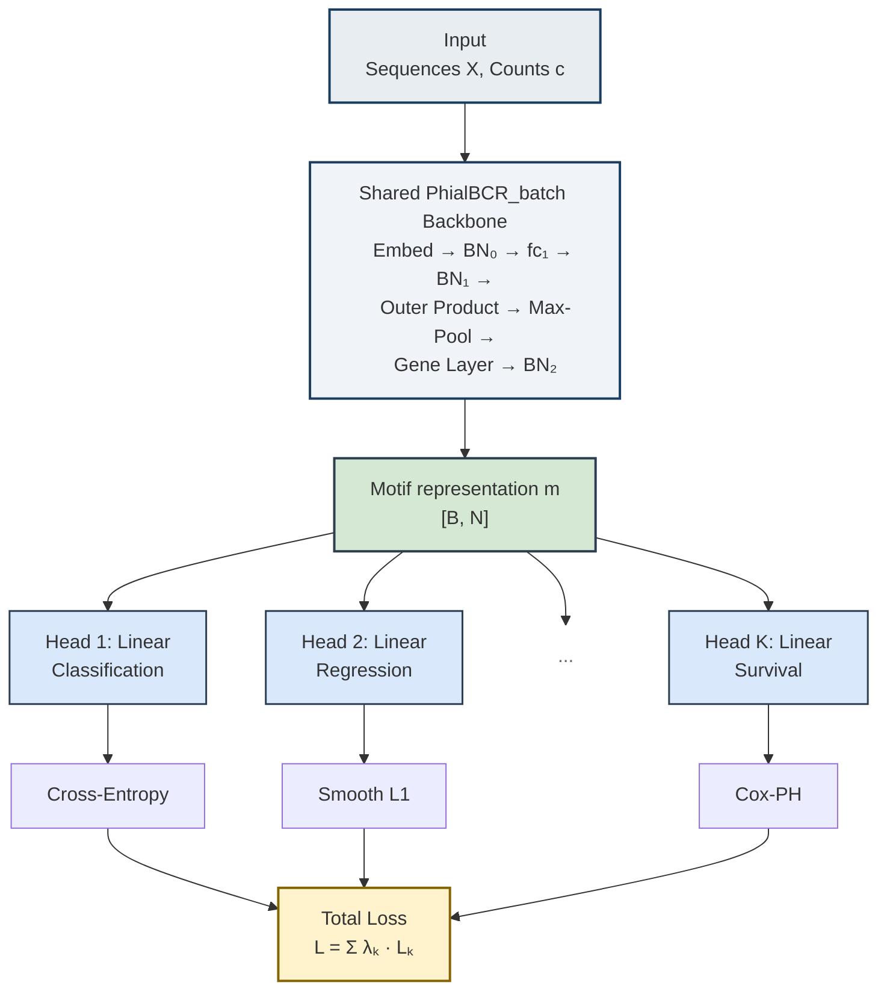

# STEAD-AI: Deep Learning Model Architectures for B Cell Receptor Repertoire Analysis

GV20 Therapeutics

*Supplementary Technical Reference*

> **Abstract**
>
> This document provides a self-contained mathematical description of the STEAD-AI model family,
> a hierarchy of deep neural networks for patient-level prediction from B cell receptor (BCR)
> repertoire data. We detail the architecture, objective functions, evaluation metrics,
> and implementation choices for each of the eight model classes, ranging from a minimal
> single-layer baseline to a multi-task learning framework that simultaneously optimizes
> classification, regression, and survival objectives.

**Contents**

1. [Introduction](#1-introduction)
2. [Notation and Conventions](#2-notation-and-conventions)
3. [Input Representation](#3-input-representation)
4. [Model Hierarchy](#4-model-hierarchy)
5. [Base Model: RepertoireModel](#5-base-model-repertoiremodel)
6. [TwoLayerModel](#6-twolayermodel)
7. [EncodeLayerModel](#7-encodelayermodel)
8. [IsotypeModel](#8-isotypemodel)
9. [IsotypeModelFast](#9-isotypemodelfastl)
10. [PhialBCR](#10-phialbcr)
11. [PhialBCR_batch](#11-phialbcr_batch)
12. [PhialBCR_MTL](#12-phialbcr_mtl)
13. [Weight Initialization and Regularization](#13-weight-initialization-and-regularization)
14. [Training Procedure](#14-training-procedure)
15. [Summary](#15-summary)
16. [References](#16-references)

## 1. Introduction

The adaptive immune system generates a diverse repertoire of B cell receptors (BCRs)
through V(D)J recombination and somatic hypermutation. The complementarity-determining
regions (CDR1, CDR2, CDR3) of these receptors encode antigen-binding specificity, and
the distribution of BCR sequences in a patient reflects their immunological history.
Computational analysis of BCR repertoires from high-throughput sequencing thus offers a
window into disease state, treatment response, and prognosis.

A fundamental challenge in repertoire-level prediction is that each patient sample
consists of a *variable-size set* of BCR sequences—ranging from hundreds to
tens of thousands—yet the prediction target is a single patient-level label. The
STEAD-AI model family addresses this challenge through a permutation-invariant
max-pooling architecture: individual BCR sequences are independently transformed into
motif activation vectors, then aggregated per patient via element-wise maximum,
yielding a fixed-dimensional representation regardless of repertoire size.

The models form an inheritance hierarchy that progressively introduces
(i) learnable amino acid embeddings,
(ii) isotype-aware gene layers that capture motif–immunoglobulin interactions,
(iii) sparse computation for efficiency,
(iv) multi-modal objective functions including survival analysis, and
(v) multi-task learning with missing-data handling.
This document provides a complete mathematical specification of each model class.

## 2. Notation and Conventions

**Table 1.** Notation used throughout this document.

| Symbol | Description |
|--------|-------------|
| $B$ | Mini-batch size (number of patients/samples) |
| $M$ | Maximum number of BCR $k$-mers per sample (zero-padded) |
| $S$ | $k$-mer length (number of amino acid positions) |
| $E$ | Amino acid embedding dimension |
| $N$ | Number of motif filters (hidden-layer width) |
| $C$ | Number of immunoglobulin isotype categories |
| $L$ | Number of output labels/targets (sign encodes mode; see Section 10) |
| $V$ | Number of valid (non-padded) $k$-mers in a batch ($V \leq B \!\times\! M$) |
| $K$ | Number of tasks (multi-task learning) |
| $\|\mathcal{A}\|$ | Amino acid vocabulary size ($= 21$, including stop codon `*`) |

We denote matrices and vectors in bold ($\bm{W}$, $\bm{x}$), scalars in italic ($\alpha$, $N$),
and sets in calligraphic script ($\mathcal{V}$, $\mathcal{A}$). The operator $[\cdot \| \cdot]$
denotes concatenation, $\odot$ denotes the Hadamard (element-wise) product, and $\otimes$ denotes
the outer product. All indices are 1-based except where noted.

## 3. Input Representation

### 3.1 Amino Acid Vocabulary

BCR sequences are represented over a vocabulary $\mathcal{A}$ of 20 standard amino acids
plus a padding token (`*`):

```
A  C  D  E  F  G  H  I  K  L  M  N  P  Q  R  S  T  V  W  Y  *
```

Each residue is mapped to an integer index $a \in \{0, 1, \ldots, 20\}$.
Sequences shorter than the required $k$-mer length are right-padded with `*`.

### 3.2 Amino Acid Embedding

Models from EncodeLayerModel onward replace integer indices with dense vector representations
via a learnable embedding layer $\bm{E}_{\text{embed}} \in \RR^{|\mathcal{A}| \times E}$.
Three initialization strategies are supported:

1. **Atchley factors** ($E = 5$): Each amino acid is initialized with its five
Atchley factor values—principal components derived from 54 physicochemical properties
of amino acids [1]. The stop codon `*` is initialized to the zero vector.
2. **Random initialization**: Standard PyTorch embedding initialization.
3. **User-supplied matrix**: An arbitrary pre-computed embedding table.

### 3.3 $k$-mer Extraction

For each BCR sequence, the CDR1, CDR2, and CDR3 amino acid sequences are first padded to
minimum lengths ($k_1$, $k_2$, $k_3$ respectively, default 3, 3, 6) and then concatenated.
Overlapping $k$-mers of length $S$ are extracted from the concatenated string with stride 1.
Each $k$-mer is associated with its immunoglobulin constant-region gene annotation (isotype).

### 3.4 Isotype Encoding

Immunoglobulin heavy- and light-chain genes are grouped into $C = 8$ categories based on
functional similarity:

**Table 2.** Immunoglobulin gene grouping used in isotype-aware models.

| Category | Constituent Genes | Immunoglobulin Class |
|----------|-------------------|----------------------|
| IGHM\|IGHD | IGHM, IGHD | IgM, IgD |
| IGHG1 | IGHG1 | IgG1 |
| IGHG2/4 | IGHG2, IGHG4 | IgG2, IgG4 |
| IGHG3 | IGHG3 | IgG3 |
| IGHA1/2 | IGHA1, IGHA2 | IgA1, IgA2 |
| IGK | IGK | κ light chain |
| IGL | IGL | λ light chain |
| Others | (all remaining) | Unresolved |

For each $k$-mer, a binary count vector $\bm{c} \in \{0, 1\}^C$ indicates which isotype
categories contributed that $k$-mer to the repertoire. The full count tensor for a batch is
$\bm{c} \in \{0, 1\}^{B \times M \times C}$.

### 3.5 Batch Representation

After preprocessing, each mini-batch consists of:

- **Sequence tensor**: $\bm{X} \in \{0, \ldots, |\mathcal{A}|\!-\!1\}^{B \times M \times S}$ — integer-encoded $k$-mers
- **Count tensor**: $\bm{c} \in \{0, 1\}^{B \times M \times C}$ — isotype indicators (or $\bm{c} \in \RR^{B \times M}$ for models without isotype awareness)
- **Target**: $\bm{y}$ — class labels, continuous values, or survival times (format depends on task)

## 4. Model Hierarchy

The eight model classes form a linear inheritance chain, where each child extends its parent
with additional architectural components:

**Figure 1.** Model inheritance hierarchy. Each child class extends its parent
with additional architectural components. The principal production model (PhialBCR) is
highlighted in green; its specialized descendants are shown in blue.



All models inherit the training loop, checkpointing, and evaluation infrastructure from
RepertoireModel (Figure 1). The shared design principle across all models is *set-level
max-pooling*: each BCR sequence is independently mapped to a feature vector, and the
element-wise maximum over all sequences in a repertoire yields a fixed-dimensional
patient representation.

## 5. Base Model: RepertoireModel

### 5.1 Architecture

RepertoireModel provides the minimal architecture as a baseline. It consists of a single
fully connected layer followed by repertoire-level max-pooling.

**Layer:** $\bm{W} \in \RR^{2 \times S}$, $\;\bm{b} \in \RR^{2}$

### 5.2 Forward Pass

Given a batch of integer-encoded sequences $\bm{X} \in \{0, \ldots, |\mathcal{A}|\!-\!1\}^{B \times M \times S}$
and counts $\bm{c} \in \RR^{B \times M}$, the input is first converted to a one-hot (binary)
representation $\bar{\bm{X}} \in \{0,1\}^{B \times M \times (S \cdot |\mathcal{A}|)}$ via a look-up
table. The forward computation is:

$$
\begin{aligned}
\bm{h}_{i,j} &= \text{ReLU}\!\bigl(\bm{W}\,\bar{\bm{x}}_{i,j} + \bm{b}\bigr) \in \RR^{2} \\[3pt]
\tilde{\bm{h}}_{i,j} &= \begin{cases} \bm{h}_{i,j} & \text{if } c_{i,j} > 0 \\ \bm{0} & \text{otherwise} \end{cases} \\[3pt]
\bm{z}_i &= \max_{j=1}^{M}\, \tilde{\bm{h}}_{i,j} \in \RR^{2}
\end{aligned}
$$

where $i$ indexes patients and $j$ indexes $k$-mers within a repertoire. Padded positions
($c_{i,j} = 0$) are zeroed before pooling so they cannot contribute to the maximum.

### 5.3 Objective and Evaluation

The output $\bm{z}_i$ is a 2-class logit vector, trained with softmax cross-entropy loss and
evaluated by classification accuracy.

## 6. TwoLayerModel

### 6.1 Architecture

TwoLayerModel extends RepertoireModel by separating the computation into a *$k$-mer
layer* (sequence → motifs) and an *output layer* (motifs → predictions),
with a configurable hidden dimension $N$.

**Layers:**

- $\text{fc}_1$: $\text{Linear}(S \cdot |\mathcal{A}| \;\to\; N)$ — $k$-mer layer
- $\text{fc}_2$: $\text{Linear}(N \;\to\; L)$ — output layer

### 6.2 Forward Pass

$$
\begin{aligned}
\bm{h}_{i,j} &= \text{ReLU}\!\bigl(\bm{W}_1\,\bar{\bm{x}}_{i,j} + \bm{b}_1\bigr) \in \RR^{N} \\[3pt]
\bm{m}_i &= \max_{j:\, c_{i,j}>0}\, \bm{h}_{i,j} \in \RR^{N} \\[3pt]
\bm{z}_i &= \bm{W}_2\,\bm{m}_i + \bm{b}_2 \in \RR^{L}
\end{aligned}
$$

The intermediate vector $\bm{m}_i$ is the *motif representation* of patient $i$:
each component records the maximum activation of a learned sequence motif across all BCRs
in the repertoire. This representation is permutation-invariant with respect to the ordering
of BCR sequences.

## 7. EncodeLayerModel

### 7.1 Architecture

EncodeLayerModel replaces the one-hot input encoding with a learnable amino acid embedding
layer, allowing the model to discover dense biochemical representations from data.

- $\text{em}$: $\text{Embedding}(|\mathcal{A}|, \, E)$
- $\text{fc}_1$: $\text{Linear}(S \cdot E \;\to\; N)$ — $k$-mer layer
- $\text{fc}_2$: $\text{Linear}(N \;\to\; L)$ — output layer

### 7.2 Forward Pass

$$
\begin{aligned}
\bm{e}_{i,j} &= \bigl[\text{Embed}(x_{i,j,1}) \;\|\; \cdots \;\|\; \text{Embed}(x_{i,j,S})\bigr] \in \RR^{S \cdot E} \\[3pt]
\bm{h}_{i,j} &= \text{ReLU}\!\bigl(\bm{W}_1\,\bm{e}_{i,j} + \bm{b}_1\bigr) \in \RR^{N} \\[3pt]
\bm{m}_i &= \max_{j:\, c_{i,j}>0}\, \bm{h}_{i,j} \in \RR^{N} \\[3pt]
\bm{z}_i &= \bm{W}_2\,\bm{m}_i + \bm{b}_2 \in \RR^{L}
\end{aligned}
$$

where $\text{Embed}: \{0, \ldots, |\mathcal{A}|\!-\!1\} \to \RR^E$ is the shared embedding
look-up for all sequence positions, and $[\cdot\|\cdot]$ denotes vector concatenation.

## 8. IsotypeModel

### 8.1 Motivation

BCR sequences carry not only CDR-region amino acid information but also immunoglobulin
isotype annotations that reflect B cell differentiation state and effector function.
IsotypeModel introduces an *isotype-aware gene layer* that models interactions
between sequence-derived motifs and isotype usage through an outer-product operation.

### 8.2 Architecture

- $\text{em}$: $\text{Embedding}(|\mathcal{A}|,\, E)$
- $\text{fc}_1$: $\text{Linear}(S \cdot E \;\to\; N)$ — $k$-mer layer
- $\text{fc}_2$: $\text{Linear}(C \;\to\; N)$ — gene layer (applied as element-wise product)
- $\text{drop}_1$, $\text{drop}_2$: $\text{Dropout}(p = 0.5)$
- $\text{out}$: $\text{Linear}(N \;\to\; L)$ — output layer

### 8.3 Forward Pass

The forward pass proceeds in five stages:

#### Stage 1: Embedding and $k$-mer layer

$$
\bm{h}_{i,j} = \text{ReLU}\!\bigl(\bm{W}_1\,\bm{e}_{i,j} + \bm{b}_1\bigr) \in \RR^{N}
$$

#### Stage 2: Outer product with isotype counts

For each $k$-mer $(i, j)$ with isotype count vector $\bm{c}_{i,j} \in \RR^C$, the motif
activation vector is broadcast across isotype channels:

$$
\bm{G}_{i,j} = \bm{h}_{i,j}\,\bm{c}_{i,j}^\top \in \RR^{N \times C}
\tag{1}
$$

This is implemented as a batched matrix multiplication:
(B×M, N, 1) × (B×M, 1, C) → (B×M, N, C).

#### Stage 3: Repertoire-level max-pooling

$$
\bm{P}_i = \max_{j:\, c_{i,j} \neq \bm{0}}\, \bm{G}_{i,j} \in \RR^{N \times C}
$$

followed by $\bm{P}_i \leftarrow \text{Dropout}_1(\bm{P}_i)$.

#### Stage 4: Motif layer

The gene-layer weight matrix $\bm{W}_2 \in \RR^{N \times C}$ modulates the pooled
motif–isotype matrix via a Hadamard product, followed by summation over the isotype
dimension:

$$
\bm{m}_i = \text{ReLU}\!\left(\sum_{c=1}^{C} \bm{P}_{i,:,c} \odot \bm{W}_{2,:,c} \;+\; \bm{b}_2\right) \in \RR^{N}
\tag{2}
$$

#### Stage 5: Output

$$
\bm{z}_i = \bm{W}_{\text{out}}\,\text{Dropout}_2(\bm{m}_i) + \bm{b}_{\text{out}} \in \RR^{L}
$$

## 9. IsotypeModelFast

IsotypeModelFast is a computationally optimized variant of IsotypeModel. Since BCR repertoires
are zero-padded to a uniform length $M$ and many positions may be empty, significant computation
is wasted on padded entries. This model filters out invalid positions before the expensive
embedding and fully connected layers.

### 9.1 Sparse Computation Strategy

Define the per-position validity indicator as the total isotype count:

$$
v_{i,j} = \sum_{c=1}^{C} c_{i,j,c}
$$

and the valid index set $\mathcal{V} = \{(i,j) : v_{i,j} > 0\}$, with $|\mathcal{V}| = V$.

**Algorithm 1: IsotypeModelFast Forward Pass**

1. Gather valid $k$-mers: $\bm{X}_{\text{valid}} \in \RR^{V \times S}$, $\;\bm{c}_{\text{valid}} \in \RR^{V \times C}$
2. Embed: $\bm{e} = \text{Flatten}\bigl(\text{Embed}(\bm{X}_{\text{valid}})\bigr) \in \RR^{V \times (S \cdot E)}$
3. $k$-mer layer: $\bm{h} = \text{ReLU}(\bm{W}_1\,\bm{e} + \bm{b}_1) \in \RR^{V \times N}$
4. Outer product: $\bm{G} = \bm{h}\,\bm{c}_{\text{valid}}^\top \in \RR^{V \times N \times C}$
5. Scatter: $\bm{G}_{\text{full}} \in \RR^{(B \cdot M) \times N \times C}$, initialized to $-\infty$ for max-pool identity, with $\bm{G}_{\text{full}}[\mathcal{V}] = \bm{G}$
6. Max-pool: $\bm{P}_i = \max_{j=1}^{M}\, \bm{G}_{\text{full}}[(i\!-\!1)M{+}1 \,:\, iM] \in \RR^{N \times C}$
7. Continue with Stages 4–5 of IsotypeModel (Eq. 2).

By processing only the $V$ valid entries through the embedding lookup and matrix
multiplications, this optimization typically reduces wall-clock time by 30–60%
on sparse repertoire data.

## 10. PhialBCR

### 10.1 Overview

PhialBCR is the principal production model. It extends IsotypeModelFast with four
prediction modes, selectable via the `num_labels` parameter, enabling the same
architecture to serve classification, regression, and survival analysis tasks.

### 10.2 Prediction Modes

**Table 3.** PhialBCR run modes determined by the `num_labels` parameter $L$.

| $L$ | Mode | Output Dim. | Task Example |
|-----|------|-------------|--------------|
| $L > 1$ | Classification | $L$ | Cancer type, treatment response |
| $L = 1$ | Scalar regression | $1$ | Continuous biomarker |
| $L = -1$ | Cox-PH survival | $1$ | Overall survival |
| $L < -1$ | Multi-target regression | $\|L\|$ | Gene expression scores |

### 10.3 Objective Functions

#### 10.3.1 Classification ($L > 1$): Cross-entropy loss

$$
\mathcal{L}_{\text{cls}} = -\frac{1}{B}\sum_{i=1}^{B}\log\frac{\exp(z_{i,y_i})}{\sum_{\ell=1}^{L}\exp(z_{i,\ell})}
\tag{3}
$$

#### 10.3.2 Regression ($L = 1$ or $L < -1$): Smooth $\ell_1$ loss

The Huber loss (smooth $\ell_1$) with transition point $\beta = 1$ is used for regression
tasks, providing robustness to outliers:

$$
\mathcal{L}_{\text{reg}} = \frac{1}{n}\sum_{i=1}^{n}
\begin{cases}
\frac{1}{2}(z_i - y_i)^2 & \text{if } |z_i - y_i| < 1 \\[2pt]
|z_i - y_i| - \frac{1}{2} & \text{otherwise}
\end{cases}
\tag{4}
$$

#### 10.3.3 Cox-PH Survival ($L = -1$): Negative log-partial likelihood

For survival analysis, the model outputs a single scalar $r_i = z_i$ interpreted as the
log-hazard ratio under a Cox proportional hazards model [2]. Let
$\delta_i \in \{0, 1\}$ be the event indicator ($1$ = event observed, $0$ = censored) and
$T_i$ the observed time. Samples must be sorted by time in descending order
($T_1 \geq T_2 \geq \cdots \geq T_n$).

The loss is the negative log-partial likelihood under the Breslow approximation [3]:

$$
\mathcal{L}_{\text{Cox}} = -\frac{1}{\sum_{i}\delta_i}\sum_{i=1}^{n}\delta_i\!\left[r_i - \log\!\sum_{k=1}^{i}\exp(r_k)\right]
\tag{5}
$$

where $\sum_{k=1}^{i}\exp(r_k)$ is the cumulative hazard sum computed via
`torch.cumsum`. This formulation sums over the at-risk set $\mathcal{R}_i = \{k : T_k \geq T_i\}$
(with descending sort and forward cumsum, $\mathcal{R}_i = \{1, \ldots, i\}$), and the loss is normalized by the
total number of observed events [4].

> **Implementation detail.** Before computing the loss, samples are sorted in
> descending order of $T_i$ via `argsort(descending=True)`. The event indicator $\delta_i$ and
> predictions $r_i$ are reindexed accordingly.

### 10.4 Evaluation Metrics

**Table 4.** Evaluation metrics for each prediction mode.

| Mode | Metric | Definition |
|------|--------|------------|
| Classification | MCC [5] | $\displaystyle\text{MCC} = \frac{\text{TP}\!\cdot\!\text{TN} - \text{FP}\!\cdot\!\text{FN}}{\sqrt{(\text{TP}{+}\text{FP})(\text{TP}{+}\text{FN})(\text{TN}{+}\text{FP})(\text{TN}{+}\text{FN})}}$ |
| Regression | Pearson $\rho$ | $\displaystyle\rho = \frac{\sum_i (z_i - \bar{z})(y_i - \bar{y})}{\sqrt{\sum_i (z_i - \bar{z})^2}\;\sqrt{\sum_i (y_i - \bar{y})^2}}$ |
| Multi-regression | Mean $\rho$ | $\displaystyle\bar\rho = \frac{1}{\|L\|}\sum_{\ell=1}^{\|L\|}\rho_\ell$ |
| Survival | C-index [6] | $\displaystyle C = \frac{\sum_{i < j}\mathbf{1}[\hat{h}_i > \hat{h}_j]\,\mathbf{1}[T_i < T_j]\,\delta_i}{\sum_{i < j}\mathbf{1}[T_i < T_j]\,\delta_i}$ |

For the C-index, $\hat{h}_i = \exp(r_i)$ is the predicted hazard. The C-index ranges from 0
to 1, where 0.5 indicates random concordance and 1.0 indicates perfect discrimination. The
implementation uses the `lifelines` library [7], which expects higher
`predicted_scores` to indicate longer survival; accordingly, the negated hazard
$-\hat{h}_i$ is passed as the predicted score.

### 10.5 Additional Distributional Metrics

PhialBCR also provides utility functions for comparing predicted and true label distributions:

**Kullback–Leibler divergence:**

$$
D_{\text{KL}}(P \,\|\, Q) = \sum_{x} P(x)\,\log\frac{P(x)}{Q(x)}
$$

**Jensen–Shannon divergence:**

$$
\text{JSD}(P, Q) = \tfrac{1}{2}\,D_{\text{KL}}(P \,\|\, M) + \tfrac{1}{2}\,D_{\text{KL}}(Q \,\|\, M), \quad M = \tfrac{1}{2}(P + Q)
$$

## 11. PhialBCR_batch

### 11.1 Motivation

PhialBCR_batch augments PhialBCR with batch normalization [8] to reduce internal covariate
shift, stabilize gradient flow, and enable the use of higher learning rates. The complete
architecture is shown in Figure 2.

### 11.2 Architecture

Three BatchNorm1d layers are inserted at key positions in the network:

**Table 5.** Batch normalization placement in PhialBCR_batch.

| Layer | Position | Dimension |
|-------|----------|-----------|
| $\text{BN}_0$ | After embedding flatten, before $k$-mer layer | $S \cdot E$ |
| $\text{BN}_1$ | After $k$-mer layer activation | $N$ |
| $\text{BN}_2$ | After motif layer activation | $N$ |

### 11.3 Forward Pass

The complete forward pass, incorporating sparse computation (Section 9) and batch
normalization, is illustrated in Figure 2 and formalized as:

**Figure 2.** PhialBCR_batch forward pass. Tensor dimensions are
annotated at each stage. *V* = number of valid (non-padded) *k*-mers;
*B* = batch size. The two key architectural contributions—repertoire-level
max-pooling and the isotype-aware gene layer—are highlighted in amber.



$$
\begin{aligned}
\bm{e} &= \text{BN}_0\!\Bigl(\text{Flatten}\bigl(\text{Embed}(\bm{X}_{\text{valid}})\bigr)\Bigr) && \in \RR^{V \times (S \cdot E)} \\[4pt]
\bm{h} &= \text{BN}_1\!\Bigl(\text{ReLU}\bigl(\bm{W}_1\,\bm{e} + \bm{b}_1\bigr)\Bigr) && \in \RR^{V \times N} \\[4pt]
\bm{G} &= \bm{h}\,\bm{c}_{\text{valid}}^\top && \in \RR^{V \times N \times C} \\[4pt]
\bm{P}_i &= \text{Dropout}_1\!\bigl(\max\nolimits_{j}\, \bm{G}_{i}\bigr) && \in \RR^{N \times C} \\[4pt]
\bm{m}_i &= \text{BN}_2\!\Bigl(\text{ReLU}\bigl(\textstyle\sum_{c=1}^{C}\bm{P}_{i,:,c} \odot \bm{W}_{2,:,c} + \bm{b}_2\bigr)\Bigr) && \in \RR^{N} \\[4pt]
\bm{z}_i &= \bm{W}_{\text{out}}\,\text{Dropout}_2(\bm{m}_i) + \bm{b}_{\text{out}} && \in \RR^{L}
\end{aligned}
\tag{6}
$$

## 12. PhialBCR_MTL

### 12.1 Motivation

In many clinical settings, multiple targets are available for each patient—for example,
cancer subtype, gene expression signatures, and survival outcome—but individual labels
may be missing for subsets of patients. PhialBCR_MTL extends PhialBCR_batch into a
multi-task learning framework that jointly optimizes over multiple heterogeneous objectives
while gracefully handling missing data through per-task NaN masking (Figure 3).

### 12.2 Architecture

The shared hidden layers are identical to PhialBCR_batch: embedding, $\text{BN}_0$,
$k$-mer layer, $\text{BN}_1$, gene layer, max-pooling, dropout, motif layer, $\text{BN}_2$,
and dropout. The single output layer is replaced by a `ModuleList` of $K$
task-specific linear heads:

$$
\bm{z}_i^{(k)} = \bm{W}_{\text{out}}^{(k)}\,\bm{m}_i + \bm{b}_{\text{out}}^{(k)}, \quad k = 1, \ldots, K
\tag{7}
$$

where the output dimension of each head is determined by the task type. Task outputs are
concatenated into a single vector $\bm{z}_i = [\bm{z}_i^{(1)} \| \cdots \| \bm{z}_i^{(K)}]$.
The architecture is illustrated in Figure 3.

**Figure 3.** PhialBCR_MTL multi-task architecture. A shared
PhialBCR_batch backbone produces the motif representation **m**, which is dispatched to
*K* task-specific linear heads. Each head computes its own loss; the total loss is
a weighted sum.



### 12.3 Multi-Task Objective

The total loss is a convex combination of per-task losses:

$$
\mathcal{L} = \sum_{k=1}^{K} \lambda_k\,\mathcal{L}_k
\tag{8}
$$

where $\lambda_1, \ldots, \lambda_K > 0$ are user-specified task weights. Each task loss
$\mathcal{L}_k$ is computed according to the task type as specified in Table 3 (cross-entropy
for classification, smooth $\ell_1$ for regression, Cox-PH for survival).

### 12.4 Missing Data Handling

Targets are allowed to contain NaN values for any task. Before computing each task loss,
samples with missing targets are filtered:

**Table 6.** NaN masking strategy for each task type.

| Task Type | $L_k$ | Masking Rule |
|-----------|--------|--------------|
| Classification | $> 1$ | Exclude samples where $y_i^{(k)}$ is NaN |
| Scalar regression | $= 1$ | Exclude samples where $y_i^{(k)}$ is NaN |
| Multi-target regression | $< -1$ | Exclude samples where *any* component of $\bm{y}_i^{(k)}$ is NaN |
| Cox-PH survival | $= -1$ | Exclude samples where $y_i^{(k)}$ is NaN |

If a task loss evaluates to NaN (e.g., when all samples in a batch are masked), it is replaced
with zero to prevent gradient corruption.

### 12.5 Survival Target Encoding

For survival tasks, the event time and censoring status are encoded in a single scalar target
using a sign convention:

$$
T_i = |y_i|, \qquad \delta_i = \mathbf{1}[y_i > 0]
\tag{9}
$$

A positive value $y_i > 0$ indicates an observed event at time $|y_i|$ ($\delta_i = 1$),
while a negative value $y_i < 0$ indicates right-censoring at time $|y_i|$ ($\delta_i = 0$).

### 12.6 Multi-Task Evaluation

Each task is evaluated with its mode-appropriate metric (Table 4). The overall score
is the sum of per-task metrics:

$$
\text{score} = \sum_{k=1}^{K} s_k
$$

where $s_k \in \{\text{MCC}_k, \rho_k, \bar\rho_k, C_k\}$ depending on task type.

## 13. Weight Initialization and Regularization

### 13.1 Weight Initialization

All models use the following initialization scheme:

**Table 7.** Weight initialization strategies by layer type.

| Layer Type | Weight Init. | Bias Init. | Reference |
|------------|-------------|------------|-----------|
| Linear (fully connected) | Xavier normal: $\;w \sim \mathcal{N}\!\left(0,\;\frac{2}{n_{\text{in}} + n_{\text{out}}}\right)$ | $\bm{0}$ | [9] |
| BatchNorm1d | $\gamma = 1$ | $\beta = 0$ | [8] |

### 13.2 Regularization

The following regularization strategies are employed:

- **Dropout** ($p = 0.5$): Applied at two positions in all isotype-aware
models—after max-pooling ($\text{Dropout}_1$) and after the motif layer
($\text{Dropout}_2$).
- **Batch normalization**: Three layers in PhialBCR_batch and its descendants
(Table 5), providing implicit regularization through mini-batch statistics [8].
- **Smooth $\ell_1$ loss**: The Huber loss used for regression tasks is less
sensitive to outliers than squared error, providing a form of robust estimation.

No explicit weight decay ($\ell_2$ penalty) is applied by default.

## 14. Training Procedure

### 14.1 Optimization

All models are trained with the Adam optimizer [11]. The default initial learning rate is
$\eta_0 = 0.01$, decayed by a step schedule:

$$
\eta_t = \eta_0 \cdot \gamma^{\lfloor t / T_{\text{step}} \rfloor}
\tag{10}
$$

where $\gamma = 0.5$ (decay factor) and $T_{\text{step}} = 10$ (step size in epochs) by default.
This is implemented via PyTorch's `StepLR` scheduler.

### 14.2 Model Selection

During training, model performance is evaluated on a held-out validation set at each epoch
using the mode-appropriate metric (Table 4). The checkpoint with the best validation score
is retained as the final model.

### 14.3 Implementation

The implementation uses PyTorch [12] and is compatible with both CPU and CUDA-enabled GPU devices.
The C-index computation relies on the `lifelines` library [7].

## 15. Summary

**Table 8.** Summary of model hierarchy. Each row describes the components added
relative to the parent model.

| Model | Parent | Components Added | New Parameters |
|-------|--------|------------------|----------------|
| RepertoireModel | nn.Module | Single linear layer, max-pool, training loop | $\bm{W} \in \RR^{2 \times S}$ |
| TwoLayerModel | RepertoireModel | Hidden motif layer of width $N$ | $\bm{W}_1 \in \RR^{N \times S}$, $\bm{W}_2 \in \RR^{L \times N}$ |
| EncodeLayerModel | TwoLayerModel | Learnable amino acid embedding | $\bm{E}_{\text{embed}} \in \RR^{|\mathcal{A}| \times E}$ |
| IsotypeModel | EncodeLayerModel | Isotype outer product, gene layer, dropout | $\bm{W}_{\text{gene}} \in \RR^{N \times C}$, $\text{drop}_{1,2}$ |
| IsotypeModelFast | IsotypeModel | Sparse valid-sequence filtering | — |
| PhialBCR | IsotypeModelFast | 4 prediction modes, Cox-PH loss, C-index | Mode-specific $\bm{W}_{\text{out}}$ |
| PhialBCR_batch | PhialBCR | Batch normalization (3 layers) | $\text{BN}_0$, $\text{BN}_1$, $\text{BN}_2$ ($\gamma, \beta$) |
| PhialBCR_MTL | PhialBCR_batch | Multi-task heads, $\lambda$-weighted loss, NaN masking | $\{\bm{W}_{\text{out}}^{(k)}\}_{k=1}^{K}$ |

---

## 16. References

1. Atchley, W.R., Zhao, J., Fernandes, A.D. & Dräke, T. Solving the protein sequence metric problem. *Proceedings of the National Academy of Sciences*, 102(18):6395–6400, 2005.
2. Cox, D.R. Regression models and life-tables. *Journal of the Royal Statistical Society: Series B*, 34(2):187–220, 1972.
3. Breslow, N.E. Covariance analysis of censored survival data. *Biometrics*, 30(1):89–99, 1974.
4. Katzman, J.L., Shaham, U., Cloninger, A., Bates, J., Jiang, T. & Kluger, Y. DeepSurv: Personalized treatment recommender system using a Cox proportional hazards deep neural network. *BMC Medical Research Methodology*, 18(1):24, 2018.
5. Matthews, B.W. Comparison of the predicted and observed secondary structure of T4 phage lysozyme. *Biochimica et Biophysica Acta (BBA) – Protein Structure*, 405(2):442–451, 1975.
6. Harrell, F.E., Califf, R.M., Pryor, D.B., Lee, K.L. & Rosati, R.A. Evaluating the yield of medical tests. *JAMA*, 247(18):2543–2546, 1982.
7. Davidson-Pilon, C. lifelines: survival analysis in Python. *Journal of Open Source Software*, 4(40):1317, 2019.
8. Ioffe, S. & Szegedy, C. Batch normalization: Accelerating deep network training by reducing internal covariate shift. *Proceedings of the 32nd International Conference on Machine Learning (ICML)*, pp. 448–456, 2015.
9. Glorot, X. & Bengio, Y. Understanding the difficulty of training deep feedforward neural networks. *Proceedings of the 13th International Conference on Artificial Intelligence and Statistics (AISTATS)*, pp. 249–256, 2010.
10. He, K., Zhang, X., Ren, S. & Sun, J. Delving deep into rectifiers: Surpassing human-level performance on ImageNet classification. *Proceedings of the IEEE International Conference on Computer Vision (ICCV)*, pp. 1026–1034, 2015.
11. Kingma, D.P. & Ba, J. Adam: A method for stochastic optimization. *Proceedings of the 3rd International Conference on Learning Representations (ICLR)*, 2015.
12. Paszke, A. *et al.* PyTorch: An imperative style, high-performance deep learning library. *Advances in Neural Information Processing Systems (NeurIPS)*, 32:8024–8035, 2019.

---

STEAD-AI — (c) GV20 Therapeutics — Apache License 2.0
